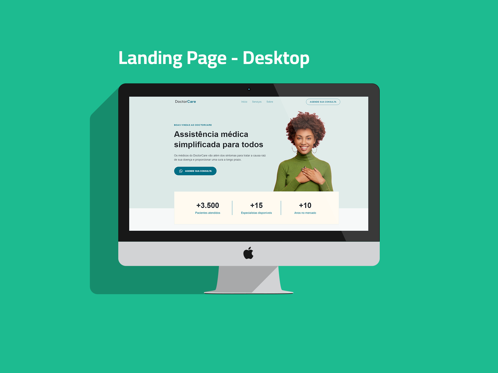
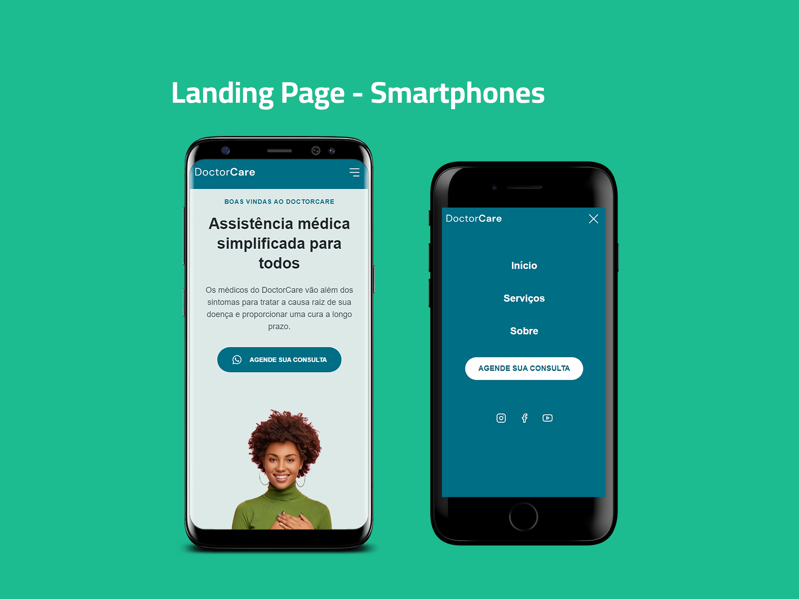

<h1 align="center">DoctorCare - Next Level Week #08</h1>

# Sobre

Este projeto foi desenvolvido para apresentar a Landing Page de uma clínica chamada DoctorCare, utilizando uma identidade visual bem elaborada e amigável, demonstrando leveza e tranquilidade em sua navegação.

Foi pensada para atender qualquer necessidade em relação à sua responsividade, ou seja, ela se ajustará perfeitamente em qualquer dispositivo móvel.

# Linguagens

<h4>Linguagens / Tecnologias utilizadas:</h4>
<ul>
    <li>HTML</li>
    <li>CSS</li>
    <li>JavaScript</li>
    <li>ScrollReveal (Para animações)</li>
    
</ul>

<h3 align="center">Visualização Desktop</h3>

<h3 align="center">Visualização Mobile</h3>

 

Link funcional do projeto: <a href="https://paulinhorox.github.io/DoctorCare/">Clique aqui</a>

Projeto realizado pela Rocketseat
